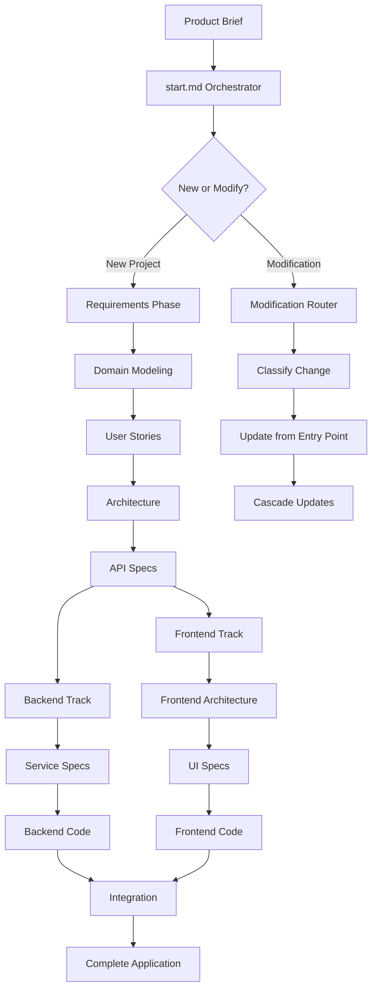

# Options Core Process - AI-Driven Development Platform

An intelligent development platform that transforms product ideas into fully implemented applications through a structured, AI-orchestrated process.

## 🚀 Quick Start Guide

### Step 1: Create Your Product Brief

Create a file with your product idea:
```bash
# Create your product brief file
touch workspace/input/product_brief.md
```

Write your product description in this file. It can be as simple as:
```markdown
I want to build a task management application where users can:
- Create and organize tasks in projects
- Set due dates and priorities
- Collaborate with team members
- Track progress with dashboards
```

### Step 2: Start the Process

Trigger the main orchestrator:
```bash
# In your AI assistant, run:
"Please follow the instructions at prompts/start.md"
```

### Step 3: What Happens Next

The orchestrator (`start.md`) will:

1. **Check workspace preferences** (first-time setup only)
   - Configure your development preferences
   - Set technology choices and standards
   
2. **Review your product brief**
   - Analyze what you want to build
   - Determine the complexity level

3. **Execute the development pipeline** automatically:

#### Backend Track
- **Requirements** → Transform your brief into a structured Product Requirements Document (PRD)
- **Domain Modeling** → Design the data architecture and entity relationships
- **User Stories** → Generate comprehensive user stories for all user types
- **Architecture** → Design the service architecture and boundaries
- **API Specifications** → Create detailed API specifications for each service
- **Service Specifications** → Define service implementations with all modules
- **Backend Development** → Generate actual backend code

#### Frontend Track (runs in parallel)
- **Frontend Architecture** → Design the frontend application structure
- **UI Specifications** → Create comprehensive UI component specifications
- **Frontend Development** → Implement the complete frontend application

#### Integration
- **Docker Compose Setup** → Create the local development environment

### Step 4: Review Your Output

After the process completes, you'll find:

```
workspace/
├── output/                     # All specifications and documentation
│   ├── requirements/          # Product Requirements Document
│   │   └── prd.md
│   ├── domain/               # Domain model and data architecture
│   │   └── domain_model.md
│   ├── stories/              # User stories
│   │   └── stories.md
│   ├── architecture/         # Service architecture
│   │   └── architecture.md
│   ├── api/                  # API specifications
│   │   ├── service1_public.md
│   │   └── service2_internal.md
│   ├── services/             # Service specifications
│   │   └── service1/
│   │       └── service.md
│   └── frontend/             # Frontend specifications
│       ├── architecture.md
│       └── ui/
│
├── code/                      # Actual implementation
│   ├── service1/             # Backend service implementations
│   ├── service2/
│   ├── frontend/             # Frontend application
│   └── integration/          # Docker Compose setup
│       └── docker-compose.yml
│
└── preferences.md            # Your project preferences and decisions
```

## 🔧 Making Changes After Development

### For Any Modifications

Whether it's a bug fix, new feature, security issue, or configuration change:

1. **Go to your AI assistant/LLM agent**

2. **Use this exact format**:
   ```
   Please follow the instructions at prompts/start.md:
   I need to add email notifications when tasks are completed
   ```
   
   Or for other changes:
   ```
   Please follow the instructions at prompts/start.md:
   Fix the security vulnerability in file upload
   ```

3. **The system will automatically**:
   - Route your request to the Modification Router
   - Analyze the impact (Level 1-11 classification)
   - Update only the affected components
   - Cascade changes through the pipeline as needed

### Modification Levels

The system intelligently classifies changes:

| Level | Impact | What Gets Updated |
|-------|--------|-------------------|
| **Level 1** | Requirements change | Everything from PRD onwards |
| **Level 2** | Domain model change | Domain model onwards |
| **Level 3** | User story change | Stories onwards |
| **Level 4** | Architecture change | Architecture onwards |
| **Level 5** | API change | API specifications onwards |
| **Level 6** | Service logic change | Service specs onwards |
| **Level 7** | Code bug fix | Only backend code |
| **Level 8** | Frontend architecture | Frontend architecture onwards |
| **Level 9** | UI change | UI specifications onwards |
| **Level 10** | Frontend code fix | Only frontend code |
| **Level 11** | Docker/integration | Only integration setup |

## 📝 Examples

### Example 1: Starting a New Project
```
Step 1: Create workspace/input/product_brief.md with your idea
Step 2: In your AI assistant, type:
        "Please follow the instructions at prompts/start.md"
Result: Complete application with all specifications and code
```

### Example 2: Adding a Feature
```
In your AI assistant, type:
"Please follow the instructions at prompts/start.md:
Add real-time price alerts to the trading platform"

System: Routes to Modification Router → Updates from Requirements → Cascades through pipeline
```

### Example 3: Fixing a Bug
```
In your AI assistant, type:
"Please follow the instructions at prompts/start.md:
The portfolio calculation is showing incorrect values"

System: Routes to Modification Router → Identifies as Level 7 (code fix) → Updates only backend code
```

### Example 4: Security Fix
```
In your AI assistant, type:
"Please follow the instructions at prompts/start.md:
Fix the authentication bypass vulnerability"

System: Routes to Modification Router → Classifies security issue → Updates affected components
```

## 🎯 Key Features

- **Intelligent Orchestration**: Automatically manages the entire development pipeline
- **Smart Routing**: Knows exactly what needs updating for any change
- **Parallel Processing**: Frontend and backend can be developed simultaneously
- **Complete Documentation**: Every decision and specification is documented
- **Production-Ready Code**: Generates actual, working implementations
- **Docker Integration**: Includes complete local development environment

## 🔄 Development Workflow



## 📚 Advanced Usage

### Reviewing Decisions
```
"I want to review and change the technology choices"
Run: "Please follow the instructions at prompts/start.md"
Select: Review Mode for the appropriate phase
```

### Workspace Preferences
The system maintains two levels of preferences:
- **Workspace-wide**: Default settings in `workspace/preferences.md`
- **Project-specific**: Decisions made during each phase

### Custom Modifications
For complex changes spanning multiple services:
- The Modification Router automatically detects the scope
- Coordinates updates across all affected components
- Maintains consistency throughout the system

## 🛠️ Troubleshooting

| Issue | Solution |
|-------|----------|
| Process seems stuck | Check if all required files exist in workspace/output/ |
| Changes not cascading | Ensure you're using start.md, not modifying files directly |
| Missing specifications | Run start.md to identify and complete missing steps |
| Integration issues | Check Docker Compose logs in workspace/code/integration/ |

## 📖 Documentation Structure

- `prompts/` - All orchestration and implementation prompts
- `templates/` - Document templates and standards
- `tools/` - Utility tools for improvements and visualization
- `workspace/` - Your project files (input, output, code)

## 🚦 Getting Started Checklist

- [ ] Create `workspace/input/product_brief.md` with your idea
- [ ] Run `prompts/start.md` to begin
- [ ] Answer preference questions (first time only)
- [ ] Watch as the system builds your application
- [ ] Review generated specifications and code
- [ ] Test with Docker Compose
- [ ] Make modifications as needed using start.md

## 💡 Tips

1. **Start Simple**: Begin with a clear, concise product brief
2. **Trust the Process**: Let the orchestrator manage the workflow
3. **Review Outputs**: Check specifications before code generation
4. **Use the Pattern**: Always use `"Please follow the instructions at prompts/start.md: [your request]"` format
5. **Keep Documentation**: The system documents everything for you

## 🔗 Next Steps

After your application is generated:
1. Review the Docker Compose setup in `workspace/code/integration/`
2. Start your local development environment
3. Test the application functionality
4. Request modifications through start.md as needed
5. Deploy to production when ready

---

## 🎯 Important Pattern to Remember

**For ALL interactions after initial setup**, use this pattern in your AI assistant:

```
Please follow the instructions at prompts/start.md:
[Your request or modification here]
```

This ensures proper routing, classification, and cascade management for all changes!

## ⚠️ Important Requirements & Notes

**Note**: This process is elaborate and not all LLMs can follow the instructions correctly at this time.

**Note**: The prompts require specific tools to work properly:
- Creating separate tasks under different roles
- File system operations (read/write/modify)
- Command execution capabilities

**Note**: Creating separate tasks with different roles serves two purposes:
1. Allows flexibility to use different LLMs for different types of tasks
2. Clears the current context, which enables the process to work for hours without context overflow issues
