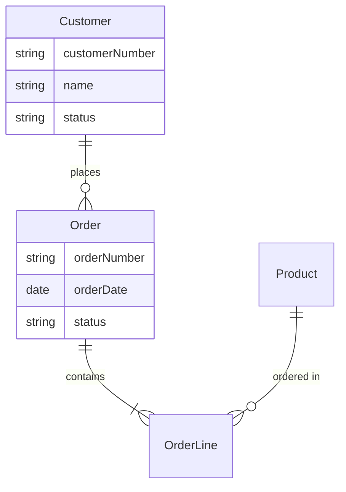
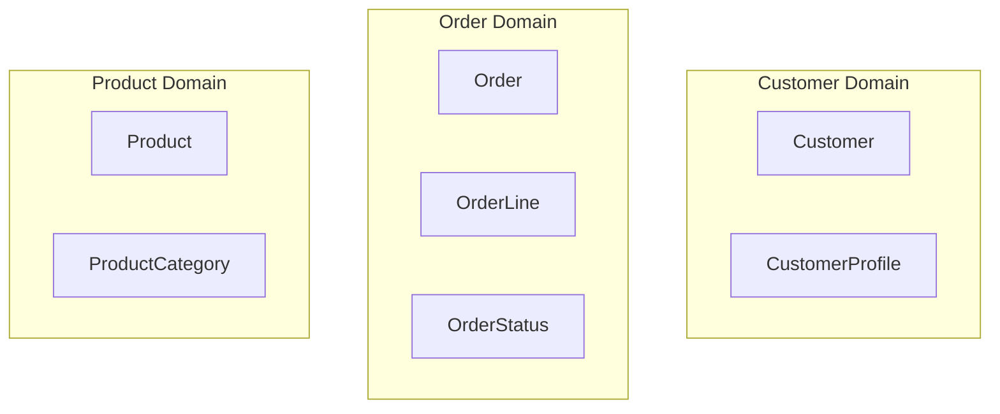

# Domain Model & Data Architecture Output Guidelines

## Domain Modeling Principles

### Entity Identification
- Extract business entities from requirements (nouns that represent core concepts)
- Focus on entities that have identity and lifecycle
- Distinguish between entities, value objects, and attributes
- Use business terminology from the PRD and company context

### Relationship Types
- **Association**: General relationship between entities
- **Aggregation**: "Has-a" relationship (whole can exist without parts)
- **Composition**: "Part-of" relationship (parts cannot exist without whole)
- **Inheritance**: "Is-a" relationship for specialized entities

### Domain Boundaries
- Group related entities into coherent domains
- Consider transaction boundaries when grouping
- Identify bounded contexts based on business capabilities
- Document shared concepts across domains

## Document Structure

### Executive Summary
Provide a concise overview of the domain model, explaining the major business entities identified, their relationships, and how they map to the product requirements. This helps readers understand the conceptual foundation before diving into details.

### Core Business Entities
For each major entity, provide:
- **Entity ID**: `ENT-[DOMAIN]-[3CHAR]` (e.g., ENT-AC-K3M for accounts domain entity)
- **Entity Name**: Using business terminology
- **Description**: Clear explanation of what this entity represents
- **Key Attributes**: Essential properties (without data types)
- **Business Identifier**: What makes each instance unique
- **Lifecycle**: Creation, modification, deletion rules
- **Business Rules**: Constraints and validations
- **PRD References**: Which requirements this entity supports

### Entity Relationships
Document all relationships between entities:
- **Relationship Diagram**: Visual representation using Mermaid.js
- **Relationship Catalog**: For each relationship:
  - **Relationship ID**: `REL-[DOMAIN]-[3CHAR]` (e.g., REL-AC-M9J for accounts domain relationship)
  - Participating entities
  - Relationship type and cardinality
  - Business rules governing the relationship
  - Cascade behaviors
  - Temporal aspects

### Domain Boundaries
- **Domain Mapping**: Group entities into logical domains
- **Bounded Contexts**: Define clear boundaries between domains
- **Shared Concepts**: Identify entities used across domains
- **Integration Points**: Where domains need to interact

### Data Ownership Strategy
- **Ownership Principles**: How data ownership is determined
- **Domain Ownership Matrix**: Which domain owns which entities
- **Reference Data**: Shared lookup data strategy
- **Master Data Management**: Approach for critical shared entities

### Consistency Patterns
- **Transaction Boundaries**: Identify consistency requirements
- **Eventual Consistency**: Where it's acceptable
- **Strong Consistency**: Where it's required
- **Saga Patterns**: For cross-domain transactions

### Data Architecture Principles
- **Data Isolation**: How domains maintain data independence
- **Data Sharing**: Patterns for cross-domain data access
- **Event Sourcing Candidates**: Entities benefiting from event history
- **CQRS Opportunities**: Read/write separation possibilities

### Glossary
- **Business Terms**: Define domain-specific terminology
- **Entity Definitions**: Quick reference for all entities with their IDs
- **Relationship Types**: Explain the relationship notation used

## ID Conventions

Use these ID formats throughout domain specifications:
- **Entities**: `ENT-[DOMAIN]-[3CHAR]` (e.g., ENT-AC-K3M for accounts domain entity)
- **Relationships**: `REL-[DOMAIN]-[3CHAR]` (e.g., REL-TR-P7R for trading domain relationship)
- **Domain Boundaries**: `DOM-[DOMAIN]-[3CHAR]` (e.g., DOM-MK-L8K for market domain boundary)

Where:
- `[DOMAIN]`: Two-letter code for the domain (AC=Accounts, TR=Trading, MK=Market, etc.)
- `[3CHAR]`: Three random alphanumeric characters

## Quality Checklist

Before finalizing domain model:
- [ ] All major business concepts from PRD are represented
- [ ] Entities use consistent business terminology
- [ ] Relationships accurately reflect business rules
- [ ] Domain boundaries align with business capabilities
- [ ] Data ownership is clearly established
- [ ] Consistency requirements are documented
- [ ] No implementation details leak into conceptual model
- [ ] Model supports all PRD requirements
- [ ] Glossary includes all domain-specific terms

## Diagram Standards

### Entity Relationship Diagram (using Mermaid.js)

### Domain Boundary Diagram

## Update Guidelines

When updating existing domain models:
- Perform gap analysis against new requirements
- Identify new entities and relationships
- Document deprecated elements
- Add changelog section noting modifications
- Preserve valuable existing analysis
- Ensure backward compatibility considerations